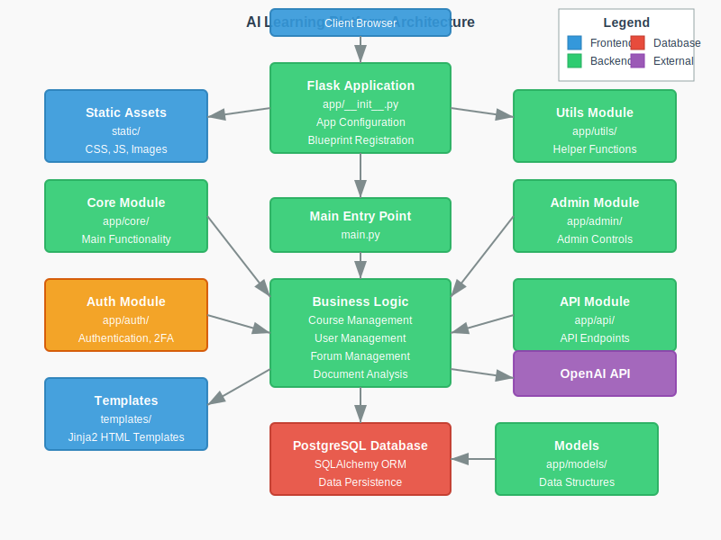
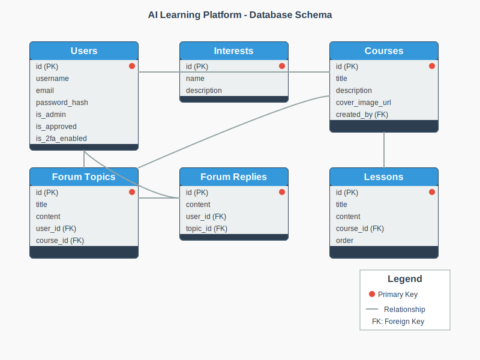

# AI Learning Platform Documentation

This document provides a comprehensive overview of the AI Learning Platform codebase, explaining its structure, functionality, and how different components work together.

## Table of Contents

1. [Project Overview](#project-overview)
2. [Directory Structure](#directory-structure)
3. [Database Models](#database-models)
4. [Authentication System](#authentication-system)
5. [Admin Features](#admin-features)
6. [User Features](#user-features)
7. [Course Management](#course-management)
8. [Interest Management](#interest-management)
9. [Forum System](#forum-system)
10. [Document Analysis](#document-analysis)
11. [API Documentation](#api-documentation)
12. [Deployment Guide](#deployment-guide)

## Project Overview

The AI Learning Platform is a Flask-based web application designed to provide an interactive learning experience with AI-enhanced features. The platform allows administrators to create courses, manage user access through interest groups, and enables users to engage with content and discuss topics in forums.



Key features include:

- User authentication with mandatory 2FA for regular users
- Admin panel for user and content management
- Interest-based access control for courses
- Course and lesson management
- General and course-specific discussion forums
- AI-powered document analysis for extracting insights from uploaded files
- Responsive UI built with Bootstrap

## Directory Structure

The application follows a modular structure organized by functionality:

```
/
├── app/                # Main application package
│   ├── __init__.py     # Application factory
│   ├── admin/          # Admin routes and functionality
│   ├── api/            # API endpoints
│   ├── auth/           # Authentication functionality
│   ├── core/           # Core application routes
│   ├── documentation/  # Project documentation
│   ├── models/         # Database models
│   └── utils/          # Utility functions
├── static/             # Static assets (CSS, JS, images)
├── templates/          # Jinja2 templates
├── instance/           # Instance-specific files
├── main.py             # Application entry point
└── tests/              # Test suite
```

## Database Models

The application uses SQLAlchemy ORM with the following key models:



- **User**: Represents system users with authentication details
- **Interest**: Topic categories that group related courses
- **Course**: Educational courses containing lessons
- **Lesson**: Individual content units within courses
- **UserInterest**: Associates users with interests and controls access
- **UserCourse**: Tracks user enrollment in courses
- **UserLessonProgress**: Tracks user progress through lessons
- **ForumTopic**: Forum discussion topics, can be general or course-specific
- **ForumReply**: User replies within forum topics
- **ApiKey**: Stores external service API keys (like OpenAI)

## Authentication System

The platform implements a robust authentication system featuring:

- Email and password-based login
- Mandatory 2FA for regular users (optional for admins)
- QR code generation for authenticator app setup
- User registration with admin approval workflow
- Password reset functionality
- Profile management

## Admin Features

Administrators have access to:

- User management (approval, deletion, 2FA reset)
- Interest management (create, edit, delete interests)
- Course management (create, edit, delete courses)
- Lesson management (create, edit, delete, reorder lessons)
- Forum moderation (pin/unpin topics, delete inappropriate content)
- API key management for external services

## User Features

Regular users can:

- Register and set up 2FA
- Update profile information
- Browse available interests
- Access courses they have been granted permission for
- Track progress through lessons
- Participate in both general and course-specific forums
- Analyze documents using the AI-powered document tool

## Course Management

Courses are:
- Organized by interests
- Composed of ordered lessons
- Accessible based on user interest permissions
- Tracked for enrollment and completion status

## Interest Management

Interests provide:
- Categorization for courses
- Access control mechanism for content
- Organization of related learning material

## Forum System

The forum system supports:
- General discussions accessible to all users
- Course-specific discussions for enrolled users
- Topic creation and replies
- Admin pinning for important discussions

## Document Analysis


The document analysis system:
- Supports PDF, DOCX, and TXT file formats
- Extracts text content from documents
- Generates summaries using OpenAI or fallback methods
- Creates contextual questions and answers about the content
- Provides a chatbot-like interface for document interaction

## API Documentation

The platform exposes several API endpoints:
- `/api/analyze-document`: Analyze uploaded documents
- `/api/check-api-config`: Check if OpenAI API key is configured
- `/api/test-openai`: Test the OpenAI connection

See [API Documentation](api.md) for detailed information about the API endpoints.

## Deployment Guide

The application can be deployed to:
- Render cloud platform
- PythonAnywhere
- Any platform supporting Python and PostgreSQL

See [Deployment Documentation](deployment.md) for detailed deployment instructions.

## Additional Documentation

The following additional documentation is available:

- [User Guide](user_guide.md): Instructions for end users on how to use the platform
- [Authentication System](authentication.md): Details about the login, registration, and 2FA implementation
- [Admin System](admin_system.md): Documentation for administrative features
- [Forum System](forum_system.md): Information about the discussion forum implementation
- [Course System](course_system.md): Details about the course and lesson management
- [Document Analysis](document_analysis.md): In-depth explanation of the document analysis feature
- [Troubleshooting Guide](troubleshooting.md): Solutions for common issues